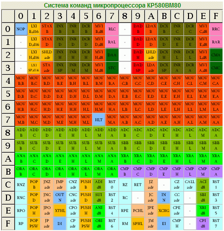

Список команд процессора 8080.

`test/java/spec/CpuTest` - интеграционный тест для тестирования всех команд процессора.
Список команд процессора 8080 и комментарии к их тестам.

* [x] 00 - NOP
* [x] 01 - LXI B,XXYY
* [x] 02 - STAX B
* [x] 03 - INX B
* [x] 04 - INR B
* [x] 05 - DCR B
* [x] 06 - MVI B,XX
* [x] 07 - RLC
* [x] 08  
* [x] 09 - DAD B
* [x] 0A - LDAX B
* [ ] 0B - DCX B
* [x] 0C - INR C
* [x] 0D - DCR C
* [x] 0E - MVI C,XX
* [x] 0F - RRC
* [x] 10
* [x] 11 - LXI D,XXYY
* [x] 12 - STAX D
* [x] 13 - INX D
* [x] 14 - INR D
* [x] 15 - DCR D
* [x] 16 - MVI D,XX
* [ ] 17 - RAL
* [x] 18
* [x] 19 - DAD D
* [x] 1A - LDAX D
* [ ] 1B - DCX D
* [x] 1C - INR E
* [x] 1D - DCR E
* [x] 1E - MVI E,XX
* [ ] 1F - RAR
* [x] 20 
* [x] 21 - LXI H,XXYY
* [x] 22 - SHLD XXYY
* [x] 23 - INX H
* [x] 24 - INR H
* [x] 25 - DCR H
* [x] 26 - MVI H,XX
* [ ] 27 - DAA
* [x] 28 
* [x] 29 - DAD H
* [x] 2A - LHLD XXYY
* [ ] 2B - DCX H
* [x] 2C - INR L
* [x] 2D - DCR L
* [x] 2E - MVI L,XX
* [ ] 2F - CMA
* [x] 30 
* [x] 31 - LXI SP,XXYY
* [x] 32 - STA XXYY
* [x] 33 - INX SP
* [x] 34 - INR M
* [x] 35 - DCR M
* [x] 36 - MVI M,XX
* [ ] 37 - STC
* [x] 38 
* [x] 39 - DAD SP
* [x] 3A - LDA XXYY
* [ ] 3B - DCX SP
* [x] 3C - INR A
* [x] 3D - DCR A
* [x] 3E - MVI A,XX
* [ ] 3F - CMC
* [x] 40 - MOV B,B
* [x] 41 - MOV B,C
* [x] 42 - MOV B,D
* [x] 43 - MOV B,E
* [x] 44 - MOV B,H
* [x] 45 - MOV B,L
* [x] 46 - MOV B,M
* [x] 47 - MOV B,A
* [x] 48 - MOV С,B
* [x] 49 - MOV C,C
* [x] 4A - MOV C,D
* [x] 4B - MOV C,E
* [x] 4C - MOV C,H
* [x] 4D - MOV C,L
* [x] 4E - MOV C,M
* [x] 4F - MOV C,A
* [x] 50 - MOV D,B
* [x] 51 - MOV D,C
* [x] 52 - MOV D,D
* [x] 53 - MOV D,E
* [x] 54 - MOV D,H
* [x] 55 - MOV D,L
* [x] 56 - MOV D,M
* [x] 57 - MOV D,A
* [x] 58 - MOV E,B
* [x] 59 - MOV E,C
* [x] 5A - MOV E,D
* [x] 5B - MOV E,E
* [x] 5C - MOV E,H
* [x] 5D - MOV E,L
* [x] 5E - MOV E,M
* [x] 5F - MOV E,A
* [x] 60 - MOV H,B
* [x] 61 - MOV H,C
* [x] 62 - MOV H,D
* [x] 63 - MOV H,E
* [x] 64 - MOV H,H
* [x] 65 - MOV H,L
* [x] 66 - MOV H,M
* [x] 67 - MOV H,A
* [x] 68 - MOV L,B
* [x] 69 - MOV L,C
* [x] 6A - MOV L,D
* [x] 6B - MOV L,E
* [x] 6C - MOV L,H
* [x] 6D - MOV L,L
* [x] 6E - MOV L,M
* [x] 6F - MOV L,A
* [x] 70 - MOV M,B
* [x] 71 - MOV M,C
* [x] 72 - MOV M,D
* [x] 73 - MOV M,E
* [x] 74 - MOV M,H
* [x] 75 - MOV M,L
* [x] 76 - HLT
* [x] 77 - MOV M,A
* [x] 78 - MOV A,B
* [x] 79 - MOV A,C
* [x] 7A - MOV A,D
* [x] 7B - MOV A,E
* [x] 7C - MOV A,H
* [x] 7D - MOV A,L
* [x] 7E - MOV A,M
* [x] 7F - MOV A,A
* [ ] 80 - ADD B
* [ ] 81 - ADD C
* [ ] 82 - ADD D
* [ ] 83 - ADD E
* [ ] 84 - ADD H
* [ ] 85 - ADD L
* [ ] 86 - ADD M
* [ ] 87 - ADD A
* [ ] 88 - ADC B
* [ ] 89 - ADC C
* [ ] 8A - ADC D
* [ ] 8B - ADC E
* [ ] 8C - ADC H
* [ ] 8D - ADC L
* [ ] 8E - ADC M
* [ ] 8F - ADC A
* [ ] 90 - SUB B
* [ ] 91 - SUB C
* [ ] 92 - SUB D
* [ ] 93 - SUB E
* [ ] 94 - SUB H
* [ ] 95 - SUB L
* [ ] 96 - SUB M
* [ ] 97 - SUB A
* [ ] 98 - SBB B
* [ ] 99 - SBB C
* [ ] 9A - SBB D
* [ ] 9B - SBB E
* [ ] 9C - SBB H
* [ ] 9D - SBB L
* [ ] 9E - SBB M
* [ ] 9F - SBB A
* [ ] A0 - ANA B
* [ ] A1 - ANA C
* [ ] A2 - ANA D
* [ ] A3 - ANA E
* [ ] A4 - ANA H
* [ ] A5 - ANA L
* [ ] A6 - ANA M
* [ ] A7 - ANA A
* [ ] A8 - XRA B
* [ ] A9 - XRA C
* [ ] AA - XRA D
* [ ] AB - XRA E
* [ ] AC - XRA H
* [ ] AD - XRA L
* [ ] AE - XRA M
* [ ] AF - XRA A
* [ ] B0 - ORA B
* [ ] B1 - ORA C
* [ ] B2 - ORA D
* [ ] B3 - ORA E
* [ ] B4 - ORA H
* [ ] B5 - ORA L
* [ ] B6 - ORA M
* [ ] B7 - ORA A
* [ ] B8 - CMP B
* [ ] B9 - CMP C
* [ ] BA - CMP D
* [ ] BB - CMP E
* [ ] BC - CMP H
* [ ] BD - CMP L
* [ ] BE - CMP M
* [ ] BF - CMP A
* [ ] C0 - RNZ
* [ ] C1 - POP B
* [ ] C2 - JNZ XXYY
* [ ] C3 - JMP XXYY
* [ ] C4 - CNZ XXYY
* [ ] C5 - PUSH B
* [ ] C6 - ADI XX
* [ ] C7 - RST 0
* [ ] C8 - RZ
* [ ] C9 - RET
* [ ] CA - JZ XXYY
* [x] CB
* [ ] CC - CZ XXYY
* [ ] CD - CALL XXYY
* [ ] CE - ACI XX
* [ ] CF - RST 1
* [ ] D0 - RNC
* [ ] D1 - POP D
* [ ] D2 - JNC XXYY
* [ ] D3 - OUT XX
* [ ] D4 - CNC XXYY
* [ ] D5 - PUSH D
* [ ] D6 - SUI XX
* [ ] D7 - RST 2
* [ ] D8 - RC
* [x] D9
* [ ] DA - JC XXYY
* [ ] DB - IN XX
* [ ] DC - CC XXYY
* [x] DD
* [ ] DE - SBI XX
* [ ] DF - RST 3
* [ ] E0 - RPO
* [ ] E1 - POP H
* [ ] E2 - JPO XXYY
* [ ] E3 - XTHL
* [ ] E4 - CPO XXYY
* [ ] E5 - PUSH H
* [ ] E6 - ANI XX
* [ ] E7 - RST 4
* [ ] E8 - RPE
* [ ] E9 - PCHL
* [ ] EA - JPE XXYY
* [ ] EB - XCHG
* [ ] EC - CPE XXYY
* [x] ED
* [ ] EE - XRI XX
* [ ] EF - RST 5
* [ ] F0 - RP
* [ ] F1 - POP PSW
* [ ] F2 - JP XXYY
* [ ] F3 - DI
* [ ] F4 - CP XXYY
* [ ] F5 - PUSH PSW
* [ ] F6 - ORI XX
* [ ] F7 - RST 6
* [ ] F8 - RM
* [ ] F9 - SPHL
* [ ] FA - JM XXYY
* [ ] FB - EI
* [ ] FC - CM XXYY
* [x] FD
* [ ] FE - CPI XX
* [ ] FF - RST 7