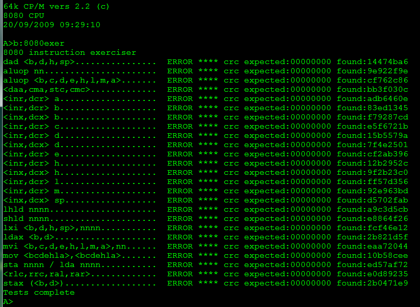

Информация о тесте
------------------

К сожалению сайт уже не работает, но можно посмотреть 
[копию страницы в веб архиве(http://web.archive.org/web/20151108135453/http://www.idb.me.uk/sunhillow/8080.html).
Оставлю копию тут для истории.
Спасибо Автору Ian Bartholomew за его работу (web234 at iandb d0t me d0t uk). 

Background
------------------

In the early 1990s Frank Cringle wrote an exerciser for the Z80 and released it under the GNU General 
Public License. The purpose of the exerciser was to test the operations of Z80 emulators against the 
results obtained from a physical Z80 CPU, and to document the results.

I was in need of a way to test my 8080 emulator, so I have modified Frank's work to provide a similar 
facility for the 8080 CPU. Details of the changes I made, and Frank's original documentation, can be 
found in the source file (link below).

The exerciser doesn't work in the way you would probably expect: perform a single CPU instruction and 
immediately check the resulting processor state. Instead it programatically selects, and executes with 
varying arguments, a series of associated opcodes (all 8 bit ALU operations for example) and after each 
operation it merges the new CPU state (registers and flag values) into a running CRC value.

After each individual group of tests you therefore end up with a single CRC value that represents the 
amalgamated results of every operation that was executed as part of that test. If you run the same test 
on a physical CPU as well as an emulator, and the generated CRC value from each source is identical, 
then you can safely assume that the emulator is working in exactly the same way as the hardware.

There are two downsides to this technique -
- You only get a Pass/Fail response. There is no indication as to which operation failed.
- You have to have access to the results of the same tests run on a physical CPU, to obtain the baseline results.

There's nothing much I can do about the first downside, that's up to the emulator writer and a lot of 
tea (or coffee). The second downside is what this page hopes to address.

Basic Exerciser
------------------

The basic exerciser has no pre-defined CRC result values. For each test it expects a 32-bit CRC of 0 
and, as a different result will always be obtained, it reports the test as failing. However, the error 
message also includes the expected CRC, and that is what we are interested in here.

I would appreciate it if anyone who has a CP/M 2.2 system running on an 8080/8085 processer 
would run the exerciser and let me know the reported values along with a description of the 
8080/8085 CPU used. I can then add the expected CRC values to an updated version of the exerciser, 
allowing emulator writers to have a simple to use test for the accuracy of their emulation.

The complete set of tests will take approximately 3 hours 20 minutes to run on a 2MHz 8080. 
However, this figure can be reduced to approximately 30 minutes by removing the 8 bit alu tests - 
albeit with a reduction in the coverage of the program. If you would prefer to run the shorter 
test suite then please contact me and I will send you a copy of the modified code; I will still 
be happy to get any results.

Basic Exerciser Files
------------------

All files are provided in three different formats:
- mac - source code for the Microsoft M80 assembler.
- com - the source assembled into a CP/M com file.
- hex - the source assembled into a CP/M (Intel format) hex file.

List of them:
- These files contain a modified version, for the 8080/8085, of Frank Cringles original preliminary test file. 
  The purpose of this additional test, to be run before the main exerciser (both 8080 and 8085 versions), 
  is just to test that the emulator is performing basic operations correctly (jmp, call, mvi etc).
  + [8080PRE.MAC (5 KB)](http://web.archive.org/web/20151108135453/http://www.idb.me.uk/sunhillow/files/8080PRE.MAC)
  + [8080PRE.COM (1 KB)](http://web.archive.org/web/20151108135453/http://www.idb.me.uk/sunhillow/files/8080PRE.COM)
  + [8080PRE.HEX (3 KB)](http://web.archive.org/web/20151108135453/http://www.idb.me.uk/sunhillow/files/8080PRE.HEX)
- These files contain the basic exerciser for a CP/M system using an 8080 CPU.
  + [8080EXER.MAC (29 KB)](http://web.archive.org/web/20151108135453/http://www.idb.me.uk/sunhillow/files/8080EXER.MAC)
  + [8080EXER.COM (5 KB)](http://web.archive.org/web/20151108135453/http://www.idb.me.uk/sunhillow/files/8080EXER.COM)
  + [8080EXER.HEX (11 KB)](http://web.archive.org/web/20151108135453/http://www.idb.me.uk/sunhillow/files/8080EXER.HEX)
- These files contain the basic exerciser for a CP/M system using an 8085 CPU.
  + [8085EXER.MAC (29 KB)](http://web.archive.org/web/20151108135453/http://www.idb.me.uk/sunhillow/files/8085EXER.MAC)
  + [8085EXER.COM (5 KB)](http://web.archive.org/web/20151108135453/http://www.idb.me.uk/sunhillow/files/8085EXER.COM)
  + [8085EXER.HEX (11 KB)](http://web.archive.org/web/20151108135453/http://www.idb.me.uk/sunhillow/files/8085EXER.HEX)

Results
------------------

| 8080                                | 1 3 4 5 8 9 10 11 12 13 | 6 7      |
|-------------------------------------|-------------------------|----------|
| DAD <B,D,H,SP>                      | 14474BA6                | <        |
| ALUOP NN                            | 9E922F9E                | 7799EA9D |
| ALUOP <B,C,D,E,H,L,M,A>             | CF762C86                | B3491C2A |
| <DAA,CMA,STC,CMC>                   | BB3F030C                | <        |
| <INR,DCR> A                         | ADB6460E                | <        |
| <INR,DCR> B                         | 83ED1345                | <        |
| <INX,DCX> B                         | F79287CD                | <        |
| <INR,DCR> C                         | E5F6721B                | <        |
| <INR,DCR> D                         | 15B5579A                | <        |
| <INX,DCX> D                         | 7F4E2501                | <        |
| <INR,DCR> E                         | CF2AB396                | <        |
| <INR,DCR> H                         | 12B2952C                | <        |
| <INX,DCX> H                         | 9F2B23C0                | <        |
| <INR,DCR> L                         | FF57D356                | <        |
| <INR,DCR> M                         | 92E963BD                | <        |
| <INX,DCX> SP                        | D5702FAB                | <        |
| LHLD NNNN                           | A9C3D5CB                | <        |
| SHLD NNNN                           | E8864F26                | <        |
| LXI <B,D,H,SP>,NNNN                 | FCF46E12                | <        |
| LDAX <B,D>                          | 2B821D5F                | <        |
| MVI <B,C,D,E,H,L,M,A>,NN            | EAA72044                | <        |
| MOV <B,C,D,E,H,L,A>,<B,C,D,E,H,L,A> | 10B58CEE                | <        |
| STA NNNN / LDA NNNN                 | ED57AF72                | <        |
| <RLC,RRC,RAL,RAR>                   | E0D89235                | <        |
| STAX <B,D>                          | 2B0471E9                | <        |

| 8085                                | 2        |
|-------------------------------------|----------|
| DAD <B,D,H,SP>                      | 44331DEF |
| ALUOP NN                            | 98FAF22B |
| ALUOP <B,C,D,E,H,L,M,A>             | -        |
| <DAA,CMA,STC,CMC>                   | 17CFAB99 |
| <INR,DCR> A                         | 9EF4EF36 |
| <INR,DCR> B                         | B0AFBA7D |
| <INX,DCX> B                         | D38A84E2 |
| <INR,DCR> C                         | D6B4DB23 |
| <INR,DCR> D                         | 26F7FEA2 |
| <INX,DCX> D                         | 5B56262E |
| <INR,DCR> E                         | FC681AAE |
| <INR,DCR> H                         | 21F03C14 |
| <INX,DCX> H                         | BB3320EF |
| <INR,DCR> L                         | CC157A6E |
| <INR,DCR> M                         | A1ABCA85 |
| <INX,DCX> SP                        | F1682C84 |
| LHLD NNNN                           | 6D1EEB35 |
| SHLD NNNN                           | 2C5B71D8 |
| LXI <B,D,H,SP>,NNNN                 | CFDFBBB3 |
| LDAX <B,D>                          | 30CDCCC6 |
| MVI <B,C,D,E,H,L,M,A>,NN            | CC3F3D29 |
| MOV <B,C,D,E,H,L,A>,<B,C,D,E,H,L,A> | E2C0FEB3 |
| STA NNNN / LDA NNNN                 | F6187EEB |
| <RLC,RRC,RAL,RAR>                   | 7EA730B3 |
| STAX <B,D>                          | B726A433 |

| Result  | Processor            | Contributor                  | Comments                                                                                                                                                                                                                                | mac  (http://web.archive.org/web/20151108135453/http://www.idb.me.uk/sunhillow/files/8080EX1.MAC) | [com](http://web.archive.org/web/20151108135453/http://www.idb.me.uk/sunhillow/files/8080EX1.COM) | [hex](http://web.archive.org/web/20151108135453/http://www.idb.me.uk/sunhillow/files/8080EX1.HEX) |
|---------|----------------------|------------------------------|-----------------------------------------------------------------------------------------------------------------------------------------------------------------------------------------------------------------------------------------|---------------------------------------------------------------------------------------------------|---------------------------------------------------------------------------------------------------|---------------------------------------------------------------------------------------------------|
| (1)     | KR580VM80A           | Alexander Timoshenko         | This CPU is a Russian copy of the original 8080. Thanks to Viacheslav Slavinsky who forwarded the results to me, and provided some helpful advice.                                                                                      | [mac](http://web.archive.org/web/20151108135453/http://www.idb.me.uk/sunhillow/files/8080EX1.MAC) | [com](http://web.archive.org/web/20151108135453/http://www.idb.me.uk/sunhillow/files/8080EX1.COM) | [hex](http://web.archive.org/web/20151108135453/http://www.idb.me.uk/sunhillow/files/8080EX1.HEX) |
| (2)     | Intel  D8085AH-1     | MdntTrain aka js@cimmeri.com | Due to time constraints the long ALUOP <B,C,D,E,H,L,M,A> test was not run.                                                                                                                                                              | [mac](http://web.archive.org/web/20151108135453/http://www.idb.me.uk/sunhillow/files/8085EX1.MAC) | [com](http://web.archive.org/web/20151108135453/http://www.idb.me.uk/sunhillow/files/8085EX1.COM) | [hex](http://web.archive.org/web/20151108135453/http://www.idb.me.uk/sunhillow/files/8085EX1.HEX) |
| (3)     | Intel  P8080A        | MdntTrain aka js@cimmeri.com | Due to time constraints the long ALUOP <B,C,D,E,H,L,M,A> test was not run.                                                                                                                                                              | [mac](http://web.archive.org/web/20151108135453/http://www.idb.me.uk/sunhillow/files/8080EX1.MAC) | [com](http://web.archive.org/web/20151108135453/http://www.idb.me.uk/sunhillow/files/8080EX1.COM) | [hex](http://web.archive.org/web/20151108135453/http://www.idb.me.uk/sunhillow/files/8080EX1.HEX) |
| (4)     | Nat. Semi.  INS8080A | Alexis                       |                                                                                                                                                                                                                                         | [mac](http://web.archive.org/web/20151108135453/http://www.idb.me.uk/sunhillow/files/8080EX1.MAC) | [com](http://web.archive.org/web/20151108135453/http://www.idb.me.uk/sunhillow/files/8080EX1.COM) | [hex](http://web.archive.org/web/20151108135453/http://www.idb.me.uk/sunhillow/files/8080EX1.HEX) |
| (5)     | TI  TMS8080AJL       | Eric Smith                   |                                                                                                                                                                                                                                         | [mac](http://web.archive.org/web/20151108135453/http://www.idb.me.uk/sunhillow/files/8080EX1.MAC) | [com](http://web.archive.org/web/20151108135453/http://www.idb.me.uk/sunhillow/files/8080EX1.COM) | [hex](http://web.archive.org/web/20151108135453/http://www.idb.me.uk/sunhillow/files/8080EX1.HEX) |
| (6)     | AMD  9080A           | Alexander Demin (3 chips)    | Alexander has looked at the two tests that differ and has tracked it down to AMD implementing the ANA/ANI instructions as Intel originally intended - the flag settings now matching the ones produced by the ORA and XRA instructions. | [mac](http://web.archive.org/web/20151108135453/http://www.idb.me.uk/sunhillow/files/8080EX2.MAC) | [com](http://web.archive.org/web/20151108135453/http://www.idb.me.uk/sunhillow/files/8080EX2.COM) | [hex](http://web.archive.org/web/20151108135453/http://www.idb.me.uk/sunhillow/files/8080EX2.HEX) |
| (7)     | AMD  8080A           | Alexander Demin              | AMD chip - as (6)                                                                                                                                                                                                                       | [mac](http://web.archive.org/web/20151108135453/http://www.idb.me.uk/sunhillow/files/8080EX2.MAC) | [com](http://web.archive.org/web/20151108135453/http://www.idb.me.uk/sunhillow/files/8080EX2.COM) | [hex](http://web.archive.org/web/20151108135453/http://www.idb.me.uk/sunhillow/files/8080EX2.HEX) |
| (8)     | Nat. Semi.  8080AN   | Alexander Demin (2 chips)    |                                                                                                                                                                                                                                         | [mac](http://web.archive.org/web/20151108135453/http://www.idb.me.uk/sunhillow/files/8080EX1.MAC) | [com](http://web.archive.org/web/20151108135453/http://www.idb.me.uk/sunhillow/files/8080EX1.COM) | [hex](http://web.archive.org/web/20151108135453/http://www.idb.me.uk/sunhillow/files/8080EX1.HEX) |
| (9)     | INTEL  8080A         | Alexander Demin (4 chips)    |                                                                                                                                                                                                                                         | [mac](http://web.archive.org/web/20151108135453/http://www.idb.me.uk/sunhillow/files/8080EX1.MAC) | [com](http://web.archive.org/web/20151108135453/http://www.idb.me.uk/sunhillow/files/8080EX1.COM) | [hex](http://web.archive.org/web/20151108135453/http://www.idb.me.uk/sunhillow/files/8080EX1.HEX) |
| (10)    | KR  58080A           | Alexander Demin (4 chips)    | Russian clone                                                                                                                                                                                                                           | [mac](http://web.archive.org/web/20151108135453/http://www.idb.me.uk/sunhillow/files/8080EX1.MAC) | [com](http://web.archive.org/web/20151108135453/http://www.idb.me.uk/sunhillow/files/8080EX1.COM) | [hex](http://web.archive.org/web/20151108135453/http://www.idb.me.uk/sunhillow/files/8080EX1.HEX) |
| (11)    | NEC  8080A           | Alexander Demin (2 chips)    |                                                                                                                                                                                                                                         | [mac](http://web.archive.org/web/20151108135453/http://www.idb.me.uk/sunhillow/files/8080EX1.MAC) | [com](http://web.archive.org/web/20151108135453/http://www.idb.me.uk/sunhillow/files/8080EX1.COM) | [hex](http://web.archive.org/web/20151108135453/http://www.idb.me.uk/sunhillow/files/8080EX1.HEX) |
| (11)    | Samsung  8080        | Alexander Demin              |                                                                                                                                                                                                                                         | [mac](http://web.archive.org/web/20151108135453/http://www.idb.me.uk/sunhillow/files/8080EX1.MAC) | [com](http://web.archive.org/web/20151108135453/http://www.idb.me.uk/sunhillow/files/8080EX1.COM) | [hex](http://web.archive.org/web/20151108135453/http://www.idb.me.uk/sunhillow/files/8080EX1.HEX) |
| (12)    | Telsa  8080A         | Alexander Demin              | Czechoslovakian clone                                                                                                                                                                                                                   | [mac](http://web.archive.org/web/20151108135453/http://www.idb.me.uk/sunhillow/files/8080EX1.MAC) | [com](http://web.archive.org/web/20151108135453/http://www.idb.me.uk/sunhillow/files/8080EX1.COM) | [hex](http://web.archive.org/web/20151108135453/http://www.idb.me.uk/sunhillow/files/8080EX1.HEX) |
| (13)    | Texas Inst.  8080A   | Alexander Demin              |                                                                                                                                                                                                                                         | [mac](http://web.archive.org/web/20151108135453/http://www.idb.me.uk/sunhillow/files/8080EX1.MAC) | [com](http://web.archive.org/web/20151108135453/http://www.idb.me.uk/sunhillow/files/8080EX1.COM) | [hex](http://web.archive.org/web/20151108135453/http://www.idb.me.uk/sunhillow/files/8080EX1.HEX) |

Grateful thanks to those listed above for providing results and advice.

The download links in the above table lead to copies of the original exerciser files 
that have had the appropriate CRC values inserted in them. When you run the exerciser 
it will then report "OK" for tests that result in the correct CRC value. It makes it a 
lot easier to spot any errors!

For more information about Alexander Demins 8080 CPU collection see 
[his blog](https://demin.ws/blog/english/2012/12/24/my-i8080-collection/).

More Results Needed
------------------

Results for other CPU hardware versions are still needed, so if you have a system with 
an 8080 or 8085 CPU the please consider running the basic emulator and forwarding the 
results to me; it really would be appreciated. Apart from the help it would provide to 
emulator writers it would be nice, even at this late stage, to document some of the 
differences between the various implementations of the 8080 and 8085 CPUs.

From Alexander Demins 
------------------

[Source is here](https://demin.ws/blog/english/2012/12/24/my-i8080-collection/)

I started programming twenty year ago coding in machine codes for Intel 8080. This microprocessor 
was my lucky pass to the fascinating world of bits and bytes. Years later developing various 
emulators of i8080 and tackling with undocumented and partially documented features of this 
processor I decided to collect real chips from different manufacturers and examine them using 
the [8080 CPU Exerciser](http://www.idb.me.uk/sunhillow/8080.html).

At the moment I have 20 processors (from Intel, AMD, National Semiconductor, NEC, Samsung, 
Texas Instruments, and also manufactured in the Soviet Union and Czechoslovakia). Amongst 
chips having a year on the label the earliest is dated back to 1974 and the latest is 1980. 
All CPUs except one are fully functional. I tested them on my 
[Радио-86РК](https://demin.ws/blog/russian/2012/10/07/rk86-sram/).

Testing revealed that all processors are identical according to the CPU Exerciser except 
clones from AMD. The AMD processors, AM8080 and AM9080A, behave differently performing the 
bitwise AND operation (ANA and ANI instruction). The original Intel CPUs and non-AMD clones 
set the AC (half-carry) flag to the value of the 3rd bit (A3) from the bitwise OR between the 
accumulator and the argument of ANA or ANI. The AMD clones always zero the AC flag in the ANA 
and ANI instructions. I don’t know why the original Intel CPU calculates the AC flag in such 
a weird way.